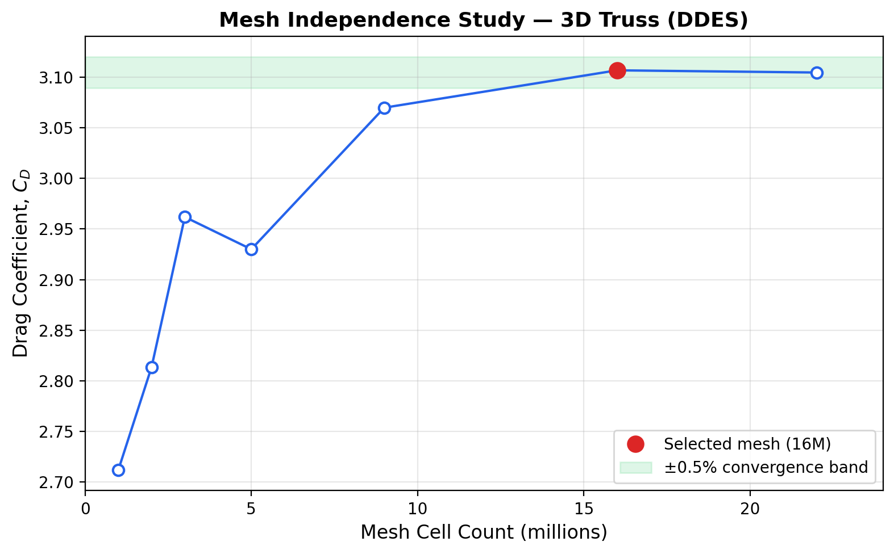
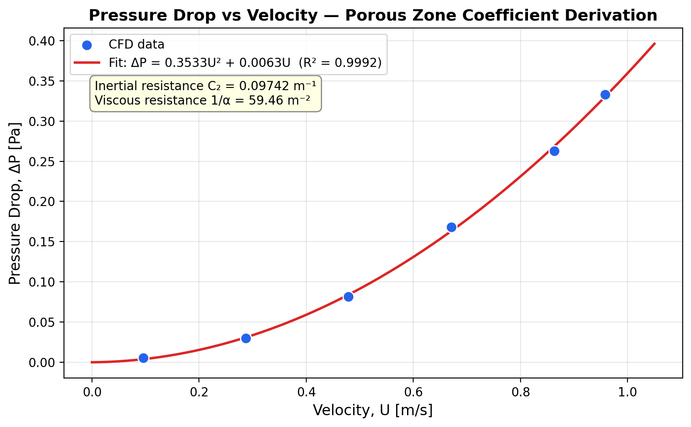
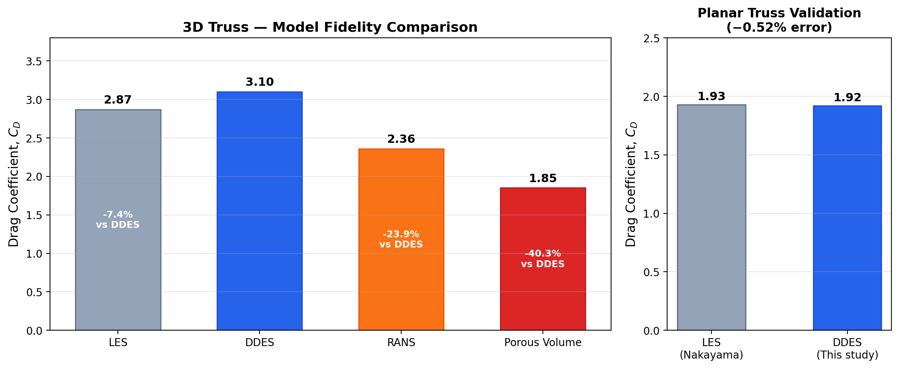
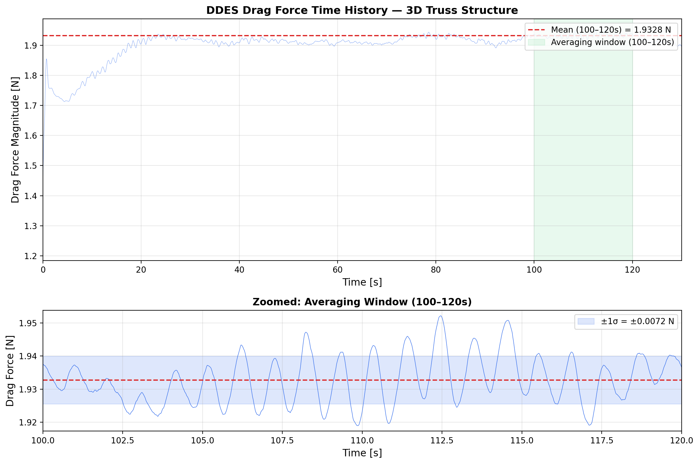

# Aerodynamics of Flow Past a Complex Truss Structure

**DDES vs Porous-Zone Modelling for Offshore Helideck Airwake Turbulence**

[]()
[-green)]()
[]()
[]()

> EPSRC-funded vacation research internship, University of Liverpool (Jun–Sep 2024)

---

## Overview

This project investigates whether **porous-zone modelling** can replace fully resolved **Delayed Detached Eddy Simulation (DDES)** when predicting aerodynamic loading and turbulence on complex 3D truss structures. The motivation comes from offshore helicopter operations: [CAP 437](https://www.caa.co.uk/publication/download/13751) regulations require that the standard deviation of airflow velocity over a helideck does not exceed 1.75 m/s. Accurate turbulence characterisation downstream of platform superstructures is therefore safety-critical.

Porous-zone substitution is attractive because it dramatically reduces mesh complexity and computational cost. The question is whether it loses too much aerodynamic fidelity to be trusted for safety applications.

**Short answer: yes, it does.** Porous-zone modelling underpredicted drag by 40% relative to DDES and captured almost none of the downstream turbulence structure.

## Key Results

### Mesh Independence

Grid convergence was established across 7 mesh densities (1M to 22M cells). The 16M-cell mesh was selected, with only 0.07% change relative to the 22M refinement.



### Porous Zone Coefficient Derivation

Porous-zone resistance coefficients were extracted by fitting a second-order polynomial to CFD pressure-drop data (R² = 0.9992). The derived inertial resistance (C₂ = 0.097 m⁻¹) and viscous resistance (1/α = 59.5 m⁻²) were used as ANSYS Fluent porous media inputs.



### Model Fidelity Comparison

Three approaches were benchmarked against published LES data (Nakayama, 2009). DDES agreed with LES within 8%, while porous-zone modelling underpredicted drag by 40%.

The DDES method was first validated on a 2D planar truss benchmark, reproducing published LES drag to within 0.52%.



### DDES Transient Behaviour

The 130-second DDES simulation (3 days 17 hours on HPC) captures the oscillatory drag behaviour caused by vortex shedding. The zoomed view shows the quasi-periodic fluctuations in the statistically steady region.



## Methodology

Three model fidelities were compared on identical domains:

| Model | Type | Description |
|-------|------|-------------|
| **DDES** | Hybrid RANS/LES | SST k-ω as RANS base, with DDES shielding functions. Bounded central differencing, coupled pressure-velocity scheme. |
| **RANS** | Steady-state | SST k-ω, same mesh and boundary conditions as DDES. |
| **Porous-zone** | Simplified RANS | Complex geometry replaced with equivalent porous volume. Resistance coefficients derived from CFD pressure-drop data. |

### Simulation Parameters

| Parameter | Value |
|-----------|-------|
| Mesh | ~16M cells (unstructured), 12 prism layers, y⁺ = 1 |
| Domain | 6.69 m windward, 18.77 m leeward, 19.54 m height |
| Inlet | 1 m/s, turbulence intensity 5%, viscosity ratio 10 |
| Time step | 0.01 s (CFL = 0.5) |
| Reynolds number | ~4 × 10⁵ |
| Runtime | 3 days 17 hours (DDES, 3D truss) |

## Repository Structure

```
├── README.md
├── requirements.txt
├── scripts/
│   ├── mesh_independence.py       # Grid convergence analysis + plot
│   ├── pressure_drop_fit.py       # Porous coefficient derivation + plot
│   ├── drag_comparison.py         # Model fidelity comparison + plot
│   └── drag_time_history.py       # Transient drag analysis + plot
├── data/
│   ├── mesh_independence.csv      # Cell count vs drag coefficient (7 points)
│   ├── pressure_drop.csv          # Velocity vs ΔP for porous fitting (6 points)
│   ├── drag_coefficients.csv      # Final Cd comparison (4 methods)
│   ├── planar_truss_validation.csv # 2D benchmark validation
│   └── drag_time_history.csv      # 13,000-point DDES force time series
└── figures/                       # Generated by scripts
```

## Quick Start

```bash
git clone https://github.com/YOUR_USERNAME/epsrc-truss-aerodynamics.git
cd epsrc-truss-aerodynamics
pip install -r requirements.txt

# Run all analyses
cd scripts
python mesh_independence.py
python pressure_drop_fit.py
python drag_comparison.py
python drag_time_history.py
```

All scripts read from `data/` and save figures to `figures/`. Each script also prints a summary table to the terminal.

## Conclusions

1. **DDES is reliable** for complex truss aerodynamics: the planar truss benchmark validates to within 0.52% of published LES.
2. **Porous-zone modelling is inadequate** for safety-critical applications: 40% drag underprediction and near-total loss of turbulence content downstream.
3. **RANS** captures bulk flow patterns but misses the unsteady vortex dynamics that matter for CAP 437 compliance.
4. For offshore helideck airwake studies, **full DDES should be used** despite the higher computational cost.

## Tools

| Tool | Purpose |
|------|---------|
| ANSYS Fluent | CFD solver (DDES, RANS, porous-zone) |
| ParaView | Flow visualisation, Q-criterion iso-surfaces |
| Python (numpy, matplotlib) | Post-processing and figure generation |
| Linux HPC | Parallel job submission for transient simulations |

## References

- Nakayama, A. (2009). Large-eddy simulation of flows past complex truss structures.
- CAP 437. Standards for Offshore Helicopter Landing Areas. Civil Aviation Authority, UK.
- Menter, F.R. & Kuntz, M. Adaptation of eddy-viscosity turbulence models to unsteady separated flow (DDES formulation).
- Mahgoub, A.O. (2020). Simulation of spectators' aerodynamic drag using porous models approximation.
- ANSYS Fluent User Manual. Porous media modelling, physical velocity formulation.

## Acknowledgements

This work was carried out as an EPSRC-funded vacation research internship at the University of Liverpool, School of Engineering.

## Contact

**Wei Jun Yap**
- Email: wjyapuni@gmail.com
- LinkedIn: [linkedin.com/in/wjunyap](https://linkedin.com/in/wjunyap)
